# Carlos the Architect - System Architecture

## Complete System Diagram

```mermaid
flowchart TB
    subgraph Frontend["Frontend (React + Vite)"]
        UI[User Interface]
        NewBlueprint[New Blueprint View]
        BlueprintTab[Blueprint Tab]
        SecurityTab[Security Audits Tab]
        ChatTab[Agent Chat Tab]
        HistoryTab[Cloud History Tab]
        AnalyticsTab[Analytics Tab]
    end

    subgraph Backend["Backend (FastAPI)"]
        API["/design Endpoint<br/>(POST)"]
        CORS[CORS Middleware]
    end

    subgraph LangGraph["LangGraph Multi-Agent Workflow"]
        START_NODE[START]

        subgraph Architects["🏗️ Architects"]
            Carlos["Carlos (Dog)<br/>Lead Cloud Architect<br/>Temp: 0.7<br/>Conservative & AWS-native"]
            Ronei["Ronei (Cat)<br/>Rival Architect<br/>Temp: 0.9<br/>Modern & K8s-focused"]
        end

        subgraph Reviewers["👥 Specialist Reviewers"]
            Security["Security Analyst<br/>Network, IAM, Encryption"]
            Cost["Cost Optimization<br/>FinOps Analysis"]
            SRE["Site Reliability Engineer<br/>Operations & Observability"]
        end

        Auditor["Chief Architecture Auditor<br/>Final Verdict<br/>(APPROVED or NEEDS REVISION)"]
        Recommender["Design Recommender<br/>Carlos vs Ronei Decision"]

        END_NODE[END]
    end

    subgraph AzureOpenAI["Azure OpenAI"]
        GPT4["GPT-4 Model<br/>(Deployment)"]
    end

    subgraph Storage["Client Storage"]
        LocalStorage["localStorage<br/>(Design History)"]
    end

    User([👤 User]) -->|Enter Requirements<br/>+ Settings| NewBlueprint
    NewBlueprint -->|POST Request| API
    API --> START_NODE

    START_NODE --> Carlos
    Carlos -->|Design Doc + Mermaid| Ronei
    Ronei -->|Alternative Design| Security

    Security -->|Security Report| Cost
    Cost -->|Cost Report| SRE
    SRE -->|Reliability Report| Auditor

    Auditor -->|Status Decision| Decision{Audit Status?}
    Decision -->|APPROVED| Recommender
    Decision -->|NEEDS REVISION| Carlos

    Recommender --> END_NODE
    END_NODE -->|JSON Response| API

    API -->|Design Bundle| UI
    UI -->|Render| BlueprintTab
    UI -->|Render| SecurityTab
    UI -->|Render| ChatTab
    UI -->|Display| AnalyticsTab

    UI -->|Save| LocalStorage
    LocalStorage -->|Load| HistoryTab

    Carlos -.->|LLM Calls| GPT4
    Ronei -.->|LLM Calls| GPT4
    Security -.->|LLM Calls| GPT4
    Cost -.->|LLM Calls| GPT4
    SRE -.->|LLM Calls| GPT4
    Auditor -.->|LLM Calls| GPT4
    Recommender -.->|LLM Calls| GPT4

    style Carlos fill:#e3f2fd,stroke:#1976d2,stroke-width:3px
    style Ronei fill:#fff3e0,stroke:#f57c00,stroke-width:3px
    style Auditor fill:#f3e5f5,stroke:#7b1fa2,stroke-width:3px
    style Recommender fill:#e8f5e9,stroke:#388e3c,stroke-width:3px
    style Decision fill:#fff9c4,stroke:#f9a825,stroke-width:2px
```



## Detailed Data Flow


## Component Responsibilities

### Frontend (React + Vite)
- **Views**: New Blueprint, Blueprint Viewer, Security Audits, Agent Chat, Analytics, History
- **Dependencies**: react-markdown, mermaid, lucide-react, tailwindcss
- **Port**: 5173 (dev), renders Mermaid diagrams inline
- **State**: localStorage for design history

### Backend (FastAPI)
- **Main Endpoint**: POST /design
- **Responsibilities**: Request validation, LangGraph orchestration, CORS handling
- **Port**: 8000
- **Dependencies**: fastapi, uvicorn, python-dotenv

### LangGraph Workflow
- **State**: CarlosState (TypedDict) with requirements, designs, reports, audit status, conversation
- **Nodes**: 7 agent nodes (design, ronei_design, security, cost, reliability, audit, recommender)
- **Flow**: Sequential with conditional loop (retry on NEEDS REVISION)

### Azure OpenAI Integration
- **Model**: GPT-4 (configurable via env vars)
- **Two Instances**:
  - Standard LLM (temp=0.7) for Carlos, specialists, auditor
  - Ronei LLM (temp=0.9) for more creative/sassy responses
- **Environment Variables**: AZURE_OPENAI_ENDPOINT, API_KEY, DEPLOYMENT_NAME, API_VERSION

## Agent Personalities

| Agent | Role | Temperature | Style | Output |
|-------|------|-------------|-------|--------|
| **Carlos (Dog)** | Lead Cloud Architect | 0.7 | Conservative, AWS-native, practical | Design doc + Mermaid flowchart |
| **Ronei (Cat)** | Rival Architect | 0.9 | Sassy, modern, K8s-focused, dramatic | Competing design + Mermaid flowchart |
| **Security Analyst** | Security Review | 0.7 | Thorough, risk-focused | Strengths, gaps, recommendations |
| **Cost Specialist** | FinOps Analysis | 0.7 | Data-driven, cost-conscious | Cost drivers, savings opportunities |
| **SRE** | Reliability & Operations | 0.7 | Operational mindset | Failure scenarios, observability |
| **Chief Auditor** | Final Verdict | 0.7 | Executive, decisive | APPROVED or NEEDS REVISION |
| **Design Recommender** | Carlos vs Ronei | 0.7 | Analytical, comparative | RECOMMEND: CARLOS or RONEI |

## Key Features

1. **Dual Design Competition**: Carlos (conservative) vs Ronei (innovative)
2. **Multi-Perspective Review**: Security, Cost, and Reliability specialists evaluate both designs
3. **Quality Gate**: Chief Auditor can reject and request revision
4. **Conversational Transcript**: All agent interactions preserved
5. **Visual Diagrams**: Mermaid flowcharts embedded in markdown
6. **Persistent History**: Designs saved in browser localStorage
7. **Analytics**: Track approval rates, scenario popularity, common blockers
8. **Context-Aware**: User can tune scenario, priorities, compliance, reliability, strictness

## Technology Stack

### Backend
- Python 3.9+
- FastAPI (web framework)
- LangGraph (agent orchestration)
- LangChain + langchain-openai (Azure OpenAI integration)
- Uvicorn (ASGI server)
- Pydantic (validation)

### Frontend
- React 18
- Vite (build tool)
- react-markdown + remark-gfm (markdown rendering)
- mermaid (diagram rendering)
- lucide-react (icons)
- Tailwind CSS (styling)

### AI/ML
- Azure OpenAI Service
- GPT-4 (or compatible chat model)
- Streaming responses for real-time feedback

## Environment Configuration

Required environment variables (backend):
```bash
AZURE_OPENAI_ENDPOINT="https://your-resource.openai.azure.com"
AZURE_OPENAI_API_KEY="your-key"
AZURE_OPENAI_DEPLOYMENT_NAME="gpt-4o"
AZURE_OPENAI_API_VERSION="2024-08-01-preview"
```

## Deployment Architecture


## Future Enhancements

- [ ] Database persistence (replace localStorage)
- [ ] User authentication & multi-tenancy
- [ ] Real-time streaming of agent conversation
- [ ] Export to Terraform/CloudFormation
- [ ] Cost estimation integration
- [ ] Diagram versioning and comparison
- [ ] Integration with CI/CD pipelines
- [ ] Multi-cloud support (Azure, GCP, AWS)
- [ ] Custom agent personalities
- [ ] Collaborative design reviews
